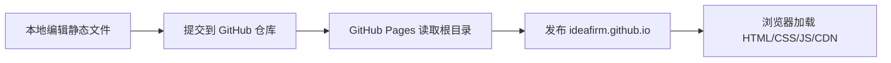
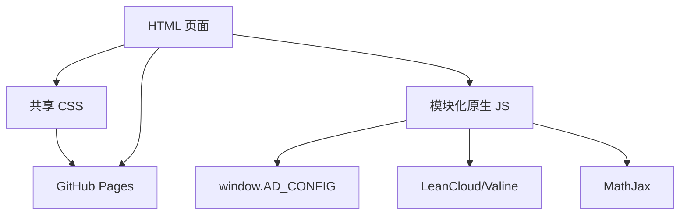
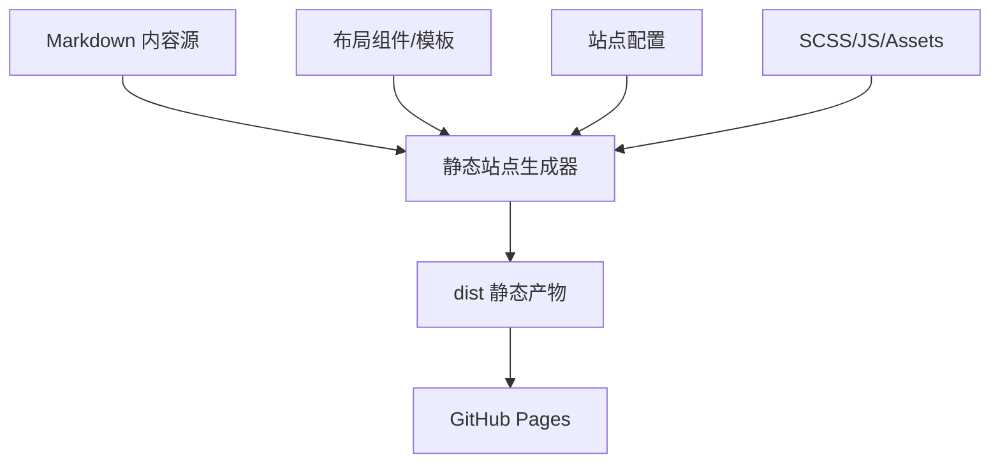

# GitHub 个人主站整体解决方案与技术架构说明

## 1. 项目定位

本仓库是 `ideafirm.github.io` GitHub Pages 个人主站项目，当前形态为可直接由 GitHub Pages 托管的静态站点。站点名称为“留给时间一点空间”，内容定位为个人数字花园，主要承载知识沉淀、工作心得、个人感悟、归档时间轴和作者介绍。

从现有文件判断，站点最初由 Hexo 3.8.0 和 `theme-ad` 主题生成，仓库中保留的是生成后的 HTML/CSS/JavaScript 静态产物，以及一部分 SCSS 样式源码。当前仓库没有完整 Hexo 源码目录、文章源文件、主题模板、`package.json` 或构建脚本，因此现阶段更适合按“静态产物维护型网站”管理。

## 2. 当前项目结构

```text
.
├── _config.yml                  # GitHub Pages/Jekyll 配置，当前仅声明 leap-day 主题
├── index.html                   # 首页，包含主导航、页脚、全局配置和基础交互入口
├── about/                       # 关于作者页面
├── knowledge/                   # 知识沉淀栏目页
├── work-insights/               # 工作心得栏目页
├── reflections/                 # 个人感悟栏目页
├── archives/                    # 归档页及年月归档静态页
├── 2019/04/24/hello-world/      # 文章静态页示例
├── css/index.css                # 主样式构建产物
├── styles/                      # 主样式 SCSS 源码
├── scss/、css/jekyll.css        # Jekyll/旧样式遗留文件
├── js/                          # 站点交互脚本
├── vendor/                      # 本地第三方脚本
├── images/、img/                # favicon、支付码、图标、装饰图片等资源
├── fonts/                       # Font/Icon 字体资源
├── main.0cf68a.* 等             # 早期构建遗留产物
└── docs/                        # 项目说明文档目录
```

### 文件类型分布

当前仓库主要由 HTML、SCSS、JavaScript、CSS 和少量图片/字体资源构成。没有服务端代码、数据库迁移、API 路由或前端包管理配置。

## 3. 技术栈现状

| 层级 | 当前技术 | 说明 |
| --- | --- | --- |
| 托管 | GitHub Pages | 通过仓库根目录静态文件发布 |
| 生成器来源 | Hexo 3.8.0 | 从页面 `meta generator` 可见，但源码工程缺失 |
| 样式 | SCSS + 编译后的 CSS | `styles/index.scss` 汇总 mixins、global、components、partials、layout |
| 脚本 | 原生 JavaScript IIFE 模块 | 每个脚本独立立即执行，通过 `window.AD_CONFIG` 共享配置 |
| 图标 | Font Awesome 4.7 + 少量内联 SVG | 导航、底栏、分享按钮使用 |
| 评论/访问统计 | LeanCloud + Valine | 由 CDN 加载，配置写在页面内 |
| 数学公式 | MathJax 2.7.5 | 支持文章内 TeX 公式渲染 |
| 分享 | X/Facebook/QQ/微博/微信二维码 | 当前首页配置启用 X 和 Facebook |
| 搜索 | Google 站内搜索 | 前端打开 `site:domain keyword` 查询 |
| 主题 | localStorage + `data-theme` | 支持 light/dark 主题切换 |

## 4. 页面架构

### 4.1 主页

`index.html` 是站点的主要入口，包含：

- `<head>` 元信息：标题、作者、关键词、描述、移动端 viewport。
- CDN 依赖：LeanCloud、MathJax、Valine、Font Awesome。
- `window.AD_CONFIG`：全局站点配置，供脚本模块读取。
- 固定顶部导航：站点品牌、栏目入口、社交链接、搜索、移动端导航按钮。
- 主内容区：以文章卡片样式展示站点欢迎内容。
- 页脚：栏目导航、阅读入口、联系方式、运行时长、访问统计。
- 全局弹层：搜索、打赏、欢迎语、微信二维码等复用。
- 底部工具栏：返回顶部、分享、打赏、主题切换、目录入口等。

### 4.2 栏目页

`knowledge/`、`work-insights/`、`reflections/`、`about/` 当前是独立静态占位页。它们没有复用主页完整布局，而是内联了一套较轻的 CSS 和主题切换逻辑。

这类页面的优点是简单、可直接访问；缺点是导航、页脚、主题切换代码重复，后续维护成本会随页面数量增加。

### 4.3 归档与文章页

`archives/` 和 `2019/04/24/hello-world/` 保留了 Hexo 静态站常见的归档和文章路径结构。文章页通常可复用：

- 文章正文容器 `.passage-article`
- 文章元信息 `.passage-meta`
- 目录侧栏 `#site-toc`
- 评论容器 `#site-comment`
- 版权信息、标签、代码高亮、MathJax 等能力

## 5. 样式架构

主样式入口为 `styles/index.scss`：

```scss
@import './mixins/';
@import './global';
@import './components/';
@import './partials/';
@import './layout/';
```

### 5.1 分层说明

- `styles/mixins/`：颜色、字体、尺寸变量，例如 `$main-width: 1024px`、`$mobile-width: 768px`。
- `styles/global.scss`：全局 reset、字体、主内容宽度、正文基础规则。
- `styles/components/`：底部工具栏、弹层、分享、评论、目录、高亮等组件样式。
- `styles/partials/`：头部、页脚等站点级片段。
- `styles/layout/`：首页、文章页、归档时间轴、集合页、关于页、友链页等布局样式。

### 5.2 主题机制

主站点采用 `document.documentElement.setAttribute('data-theme', theme)` 标记主题，`css/index.css` 中有 `[data-theme="dark"]` 相关规则覆盖默认浅色主题。

栏目占位页则使用 CSS 变量：

```css
:root[data-theme="light"] { ... }
:root[data-theme="dark"] { ... }
```

建议后续统一为一套主题机制，避免主页和栏目页视觉与实现分叉。

## 6. JavaScript 架构

主脚本入口是 `js/index.js`。它先初始化 `window.AD_CONFIG.layer` 回调队列，再按时机懒加载其他脚本：

- `DOMContentLoaded` 后加载：复制、弹层、滚动进度、返回顶部、站点计时、头部导航、文章图片、分享、打赏、主题切换。
- `window.load` 后加载：LeanCloud 统计/评论、MathJax 配置。

### 6.1 核心脚本职责

| 文件 | 职责 |
| --- | --- |
| `js/index.js` | 全局脚本调度、弹层回调队列初始化 |
| `js/auth.js` | 文章密码访问控制、主题版本信息输出 |
| `js/header.js` | 搜索弹层、移动端导航抽屉 |
| `js/layer.js` | 全局遮罩层关闭和回调触发 |
| `js/scroll.js` | 顶部阅读进度条 |
| `js/backTop.js` | 平滑返回顶部 |
| `js/time.js` | 根据 `start_time` 计算站点运行时长 |
| `js/theme.js` | 主页主题切换，写入 `localStorage.theme` |
| `js/share.js` | 社交分享链接和微信二维码分享 |
| `js/reward.js` | 打赏二维码弹层 |
| `js/passage.js` | 文章图片点击打开、文章目录侧栏控制 |
| `js/leancloud.js` | 访问统计、欢迎提示、Valine 评论初始化 |
| `js/mathjax.js` | MathJax 渲染配置 |

### 6.2 全局配置

每个完整页面需要提供 `window.AD_CONFIG`，主要字段如下：

```js
window.AD_CONFIG = {
  leancloud: { appid, appkey, comment, count },
  welcome: { enable, interval },
  start_time: "2008-01-01",
  passwords: ["...sha256..."],
  is_post: false,
  lock: false,
  author: "YG",
  share: { twitter: true, facebook: true, weibo: false, qq: false, wechat: false },
  mathjax: true,
  page_type: "",
  root: "/"
};
```

`window.AD_CONFIG` 是当前站点脚本模块之间的事实契约。新增页面时如果引用 `js/index.js`，必须保证该对象和相关 DOM 节点存在，否则部分脚本可能因为查询不到元素而报错。

## 7. 部署架构

当前部署链路非常简单：



### 本地预览建议

因为页面内大量资源使用绝对路径 `/css/index.css`、`/js/index.js`，建议使用本地静态服务器预览，而不是直接双击 HTML。

可选命令：

```powershell
python -m http.server 4000
```

然后访问：

```text
http://localhost:4000/
```

## 8. 当前问题与风险

### 8.1 源码与产物边界不清

仓库同时存在：

- Hexo 生成产物：`index.html`、`archives/`、`2019/.../index.html`
- SCSS 源码：`styles/`
- 编译后样式：`css/index.css`
- 旧构建产物：`main.0cf68a.css`、`main.0cf68a.js`、`mobile.992cbe.js`、`slider.e37972.js`
- Jekyll 配置和样式遗留：`_config.yml`、`css/jekyll.css`、`scss/jekyll.scss`

建议明确“当前以根目录静态文件为发布产物”，并将可编辑源码、历史遗留、运行时资源分区说明。

### 8.2 Hexo 源工程缺失

页面标明由 Hexo 3.8.0 生成，但没有：

- `package.json`
- `_config.yml` 的 Hexo 配置
- `source/_posts`
- `themes/`
- layout 模板

这意味着无法稳定地通过 Hexo 重新生成整个站点。继续手改 HTML 可行，但规模扩大后会出现重复布局、链接同步和归档维护问题。

### 8.3 外部 CDN 可用性风险

站点依赖多个外部 CDN：

- LeanCloud SDK
- Valine
- MathJax
- Font Awesome

CDN 不可用时，评论、统计、图标或公式会降级甚至失效。面向长期个人主站，建议将关键静态依赖固定版本并尽量本地化。

### 8.4 前端容错不足

部分脚本默认 DOM 节点一定存在，例如主题按钮、访问统计节点、分享按钮等。若某个页面引用了主脚本但缺少对应节点，可能抛出运行时错误。

### 8.5 配置暴露

LeanCloud `appid` 和 `appkey` 暴露在前端页面中，这是前端统计/评论类服务的常见形态，但必须依赖 LeanCloud ACL 和服务端安全规则控制写入权限。当前访问日志写入 `Counter`，需要确保云端权限配置正确。

### 8.6 栏目页重复实现

多个栏目页存在高度重复的内联 CSS 和主题切换脚本。后续如果改动品牌、导航、页脚或主题规则，需要逐页维护。

## 9. 整体解决方案

### 9.1 短期方案：稳定静态站点

目标：不重构框架，先让当前仓库具备清晰维护边界。

建议动作：

1. 保留根目录静态发布模式，继续使用 GitHub Pages。
2. 为所有页面统一 UTF-8 编码、基础 meta、标题和描述。
3. 抽取栏目页重复样式为共享 CSS，减少内联代码。
4. 为主脚本增加 DOM 判空，提升页面复用安全性。
5. 清点并标注遗留产物，确认不用的文件再移入归档目录或删除。
6. 固定第三方 CDN 版本，优先本地化 Font Awesome、MathJax、Valine 等关键依赖。
7. 增加 `README.md`，说明本地预览、目录结构、发布流程和新增页面规范。

适合场景：内容规模较小，主要手工维护首页和少量栏目页。

### 9.2 中期方案：恢复静态生成能力

目标：把当前“生成产物仓库”恢复为“源码可生成仓库”。

有两条路线：

路线 A：恢复 Hexo

- 重建 `package.json`，固定 Hexo 和主题依赖版本。
- 恢复 `source/_posts`、`source/about`、`source/categories` 等内容源。
- 将当前 HTML 中的品牌、导航、页脚和配置迁回主题模板。
- 使用 `hexo generate` 生成静态文件，再发布到 GitHub Pages。

路线 B：迁移到现代静态站点生成器

- 选型 Astro、VitePress、Eleventy 或 Hugo。
- Markdown/MDX 管理文章。
- 组件化 Header、Footer、ArticleLayout、ArchiveList。
- 构建产物输出到 GitHub Pages。

对个人知识沉淀型站点，若希望长期维护和扩展，推荐 Astro 或 VitePress；若希望最大限度继承旧路径和主题，推荐恢复 Hexo。

### 9.3 长期方案：个人数字花园平台化

目标：从“静态博客”演进为可持续沉淀的个人知识系统。

建议能力：

- 内容模型：文章、笔记、项目、书摘、年度总结、标签、系列专题。
- 信息架构：首页、知识沉淀、工作心得、个人感悟、项目作品、时间轴、关于。
- 搜索：引入本地索引搜索，避免依赖 Google 站内搜索。
- 资产管理：统一图片目录、封面图、附件、文章资源引用规范。
- 自动化：GitHub Actions 构建、链接检查、HTML 校验、部署。
- 可观测：访问统计、错误监控或轻量 Analytics。
- SEO：sitemap、RSS、Open Graph、Twitter Card、结构化数据。

## 10. 推荐技术架构

### 10.1 推荐一：保守维护架构

适合当前仓库立即落地。



核心原则：

- 页面仍是静态 HTML。
- 共享布局和样式尽量减少重复。
- JS 模块必须能在缺少部分 DOM 的页面上安全退出。
- 所有资源路径保持 GitHub Pages 根路径可用。

### 10.2 推荐二：源码生成架构

适合后续内容增长。



核心原则：

- 内容使用 Markdown 管理。
- 站点配置集中化。
- 页面布局组件化。
- 归档、标签、RSS、sitemap 自动生成。
- 构建流程可重复、可验证。

## 11. 内容与信息架构建议

建议将现有栏目明确为：

- 首页：个人定位、最近更新、精选专题、站点导航。
- 知识沉淀：技术笔记、项目经验、工具方法、工程实践。
- 工作心得：管理经验、协作方法、职业复盘、组织观察。
- 个人感悟：生活随笔、读书笔记、人生思考。
- 时间轴：按年份/月归档，展示长期沉淀脉络。
- 关于作者：个人简介、联系方式、社交链接、版权声明。

文章元数据建议统一：

```yaml
title: 文章标题
date: 2026-06-26
updated: 2026-06-26
category: 知识沉淀
tags:
  - GitHub Pages
  - 静态站点
summary: 一句话摘要
cover: /images/posts/example.jpg
private: false
```

## 12. 维护规范建议

### 12.1 新增页面

新增页面应至少包含：

- UTF-8 编码声明。
- 唯一标题和描述。
- 统一导航入口。
- 主题初始化脚本。
- 可访问的返回路径。
- 如加载 `js/index.js`，必须提供 `window.AD_CONFIG` 和必要 DOM。

### 12.2 新增脚本

脚本建议遵循：

- 使用 IIFE 或模块化封装，避免污染全局变量。
- 从 `window.AD_CONFIG` 读取配置，不硬编码站点级常量。
- 查询 DOM 后先判空。
- 外部服务失败时静默降级或显示轻量提示。

### 12.3 新增样式

样式建议遵循：

- 优先修改 `styles/` 下 SCSS，再编译到 `css/index.css`。
- 复用 `$main-width`、`$mobile-width`、颜色和字体变量。
- 主题色变更同步覆盖浅色和深色模式。
- 避免在多个 HTML 文件中复制大段内联 CSS。

## 13. 建议实施路线图

### 第一阶段：文档化与稳定性

- 增加 `README.md` 和本架构文档。
- 明确当前发布方式和本地预览命令。
- 为现有 JS 增加 DOM 判空。
- 统一栏目页的共享样式和主题脚本。

### 第二阶段：内容结构整理

- 完善知识沉淀、工作心得、个人感悟三个栏目页。
- 将旧文章和未来文章统一到固定 URL 规范。
- 建立标签、分类、归档维护方式。
- 补充 SEO、Open Graph、RSS 和 sitemap。

### 第三阶段：构建系统恢复或迁移

- 若继续 Hexo：恢复 Hexo 源码和主题模板。
- 若迁移现代框架：选型 Astro/VitePress，并保留旧 URL 跳转。
- 使用 GitHub Actions 自动构建和发布。
- 引入链接检查、HTML 校验和简单视觉回归检查。

## 14. 当前结论

当前项目已经可以作为 GitHub Pages 静态主页运行，但它更像是历史 Hexo 站点的发布产物，而不是完整源码工程。短期应以“稳定现有静态站点、降低重复、补齐文档”为优先；中长期应恢复静态生成能力，让内容、模板、样式和部署流程重新可重复、可扩展、可验证。
